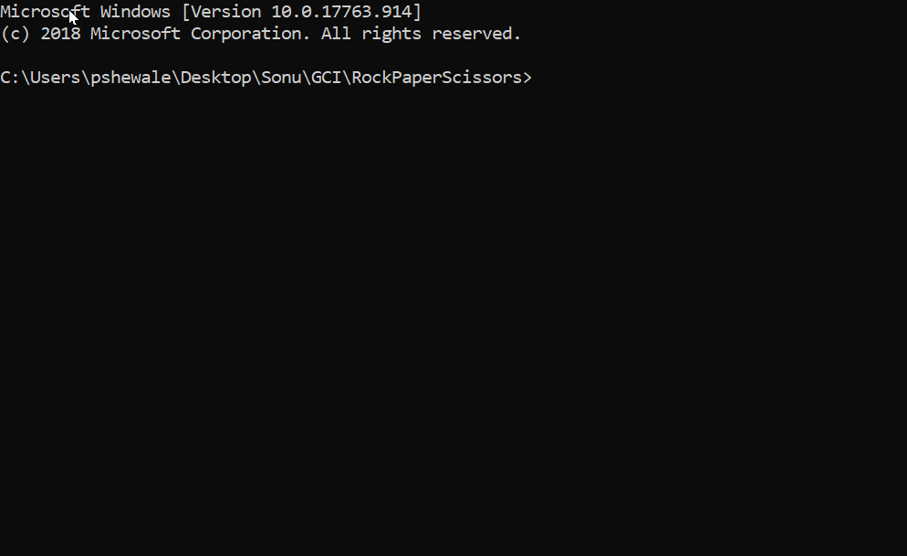

# RockPaperScissors
 RockPaperScissors, but without if statements. Also, OOP!

# Demo

# How to Play
Just enter "Rock", "Paper" or "Scissors" at the prompt! (Input is NOT case sensitive)

# Why OOP?
It is very easy to create derivatives such as Rock Paper Scissors Lizard Spock, etc! It does not include weird repeated
or nested ternary operators.

# Why ternary operators instead of `if`s?
Why not?