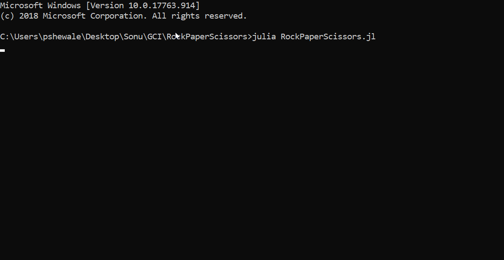

# RockPaperScissors
 RockPaperScissors, but without if statements. Also, OOP!

## Demo

## How to Play
Just enter "Rock", "Paper" or "Scissors" at the prompt! (Input is NOT case sensitive)
Game is best of 3. If game is a tie, you'll have to play again.

## Why OOP?
It is very easy to create derivatives such as Rock Paper Scissors Lizard Spock, etc!

## Why ternary operators instead of `if`s?
Why not?